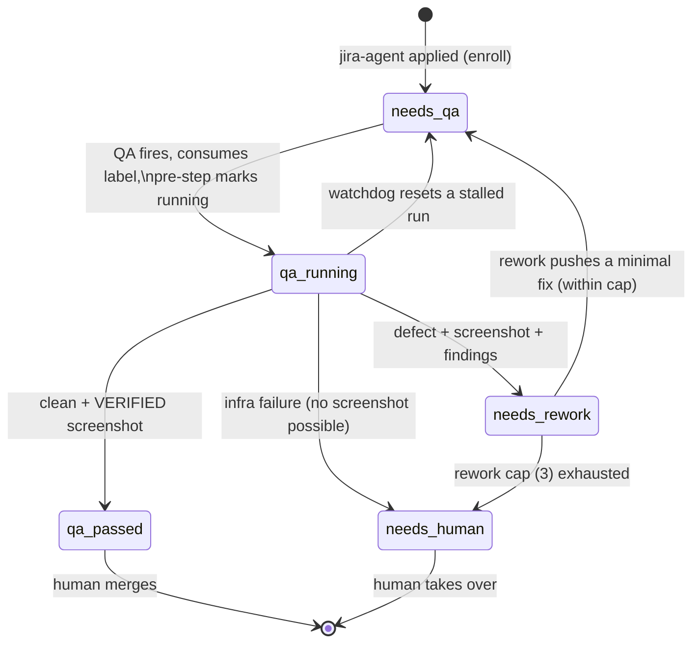

# care_fe QA label state machine

A label-driven QA pipeline built from [GitHub Agentic Workflows](https://github.github.com/gh-aw/)
(gh-aw). The **`state:*` labels are the single authoritative stage** of every enrolled
pull request; each workflow reacts to exactly one state label, does its work, and
advances the PR to the next state. There is no central orchestrator — the machine is
fully decentralized, the same pattern gh-aw uses on its own PRs.

> **Merge is always human.** Nothing here auto-merges, gates merges, or reacts to a
> merge. `state:qa-passed` and `state:needs-human` are terminal; automation stops and
> waits for a person.

## States (mutually exclusive)

Seed them once with [`.github/scripts/seed-state-labels.sh`](scripts/seed-state-labels.sh)
(idempotent). Exactly one is ever active on a PR — every transition removes the whole
set and adds exactly one (`add-labels: { max: 1 }`).

| Label | Colour | Meaning | Who sets it |
|-------|--------|---------|-------------|
| `state:needs-qa` | `1D76DB` | Queued for backend-seeded visual QA | enroll, rework, watchdog |
| `state:qa-running` | `FBCA04` | Visual QA in progress (crash-detectable) | QA pre-step |
| `state:qa-passed` | `0E8A16` | **Terminal** — QA passed, awaiting human merge | QA |
| `state:needs-rework` | `D93F0B` | A UI defect was found; automated rework queued | QA |
| `state:needs-human` | `B60205` | **Terminal** — escalated, needs a human | QA (infra), rework (cap) |

These are namespaced under `state:` so they never collide with the repo's existing,
independent label automation (`needs testing` / `needs review` / `changes required` /
`Tested` / `reviewed`, driven by `pr-automation.yml`).

## Transitions

`state:needs-qa` (entry / re-enter) · `state:qa-running` · `state:qa-passed` (terminal) ·
`state:needs-rework` · `state:needs-human` (terminal).

## The mandatory-screenshot gate

A PR can **only** reach `state:qa-passed` when QA captured and published (via
`upload-asset`) **at least one durable screenshot of the actual changed feature**
against a real, seeded, logged-in backend. No verified screenshot ⇒ QA must **not**
pass:

- An **observed UI defect** (with findings) ⇒ `state:needs-rework`.
- An **infrastructure failure** that is not the PR's fault (backend won't boot, the
  preview server is unreachable) ⇒ `state:needs-human`.
- A build/render failure caused by the PR ⇒ `state:needs-rework` with the error as the
  finding.

A login screen, a generic smoke path, or "the app booted" is **never** accepted as
evidence that the feature works.

## Workflows

| File | Trigger | Role |
|------|---------|------|
| `qa-bootstrap-enroll.yml` | `pull_request_target` (opened/labeled/…) | Plain, deterministic. When `jira-agent` is present and no `state:*` label exists yet, add `state:needs-qa`. |
| `qa-mark-running.yml` | `pull_request_target` (labeled `state:needs-qa`) | Plain, deterministic. Flips `state:needs-qa` → `state:qa-running` the moment QA starts, so the running stage is visible and crash-detectable. Runs in parallel with the QA workflow on the same event. |
| `pr-qa-playwright.md` | `label_command: state:needs-qa` | Boots the seeded care backend (`make up load-fixtures`), builds the PR head, logs in, navigates to the **exact** changed feature (creating seed data via the backend REST API when fixtures lack it), runs one focused Playwright spec, captures before/after screenshots, publishes them, and advances to `state:qa-passed` / `state:needs-rework` / `state:needs-human`. Tears the backend down. |
| `pr-rework.md` | `label_command: state:needs-rework` | Reads QA's findings, makes a minimal fix, validates (`lint-fix`/`build`/`tsc`), pushes to the PR branch (`[skip-ci]`, constrained `allowed-files`), and re-labels `state:needs-qa`. Enforces a hard rework cap of 3; on exhaustion escalates to `state:needs-human`. |
| `qa-watchdog.md` | `schedule` (hourly) | Resets PRs stuck in `state:qa-running` past a threshold (a crashed/cancelled QA run) back to `state:needs-qa`, and re-enrols enrolled PRs that lost their state label (a crashed rework). |

### Why every state write uses the agent PAT

GitHub suppresses workflow triggers from events caused by the default `GITHUB_TOKEN` (the
recursion guard), and gh-aw's `label_command` activation additionally requires the actor who
applied the label to be a write+ member. So **every** label that must advance the machine —
enrol's `state:needs-qa`, the companion's `state:qa-running`, QA's verdict, rework's
hand-back — is written with `secrets.GH_AW_AGENT_TOKEN` (falling back to `GITHUB_TOKEN`, under
which the cascade simply won't fire). The agentic stages do this through their
`add-labels`/`remove-labels` safe outputs (`github-token:` override); the deterministic
workflows do it by setting `GH_TOKEN` for `gh`.

### Why the trigger label is the dedup

`label_command` **consumes** (auto-removes) its trigger label when the workflow starts.
A run therefore happens exactly once per labelling; to re-run a stage you re-apply its
label. That removes any need for SHA-keyed dedup bookkeeping — the label *is* the lock.

### Concurrency

Each stage workflow relies on gh-aw's built-in two-level concurrency (the per-PR worker
group plus the global `conclusion` group with `cancel-in-progress: false`). No hand-rolled
mutex — label races are avoided because transitions are serialized by that machinery.

### Durable payload

Labels are authoritative; the per-run payload (verdict, run number, the validated head
SHA) is recorded in QA's durable PR comment behind a machine-readable
`<!-- qa-state-payload: {...} -->` marker. The rework cap is tracked by the shared
`loop-guard` fragment (cache-memory plus durable "automated fix attempt N" comment
markers), so it survives cache eviction.

## Security

Every agentic stage treats all PR content (title, description, diff, comments, console
output) as untrusted data and never executes instructions found in it. The QA agent only
screenshots the already-running app; the rework agent only makes the smallest fix needed
and never weakens tests to go green.

## Operating it

1. Seed labels: `./.github/scripts/seed-state-labels.sh amjithtitus09/care_fe`
2. Apply `jira-agent` to a PR (or open one with it) → it enters at `state:needs-qa`.
3. Watch the label advance. Re-run any stage by re-applying its `state:*` label.
4. A human merges once a PR reaches `state:qa-passed`, or takes over on `state:needs-human`.
